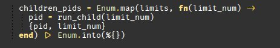

# Purpose

Vim looks awesome using font with ligatures:



Use [FiraCode](https://github.com/tonsky/FiraCode) or similar font for it.

# Ligature support setup in GVim

After installing `vim8-ligatures*.deb` package you need to enable ligatures support in GVim.

Put in `~/.gvimrc` line:
```
let g:gtk_nocache=[0x00000000, 0xfc00ffff, 0xf8000001, 0x78000001]
```

Setting font to `Fira Code` may look like:

```
set guifont=Fira\ Code\ 10
```

# Automate build of Vim8 with ligatures

This repository provides build automation to
- check out latest version of Vim8 repository
- apply ligatures patch and build Vim8
- build debian package


# Fully automated way

You will need `Docker` and `docker-compose` installed.
Build is done inside Docker image to avoid polluting host system with all
development packages.

Just run in top directory
```
docker-compose build
docker-compose up
```

Depending on your machine it will take 5-10 minutes to build Vim. Initial build
of Docker image may take more time to fetch all dependency packages.

Resulting .deb file is in `data` directory, install it with

```
sudo dpkg -i data/vim8-ligatures_8.0.*.deb
```

Vim will install into `/opt/vim8-ligatures/`. You may need to create symlink to run it.

```
sudo ln -s /opt/vim8-ligatures/bin/gvim /usr/bin/gvim8-ligatures
```


# Running build process manually

## Create Docker image

```
docker build . -t vimbuilder:latest
```

## Run build in container

```
docker run --rm -ti -v`pwd`/data:/data vimbuilder:latest /bin/bash

./build.sh
```

If you want to run separate steps in build process - check build.sh.


# FAQ

## Build process hangs on 'Copying files to the temporary directory...'

This is slowest part of checkinstall which is used to create package.
Go drink some water or tea or coffee.
It usually takes 5-10 minutes to assemble package with a lot of small files.
